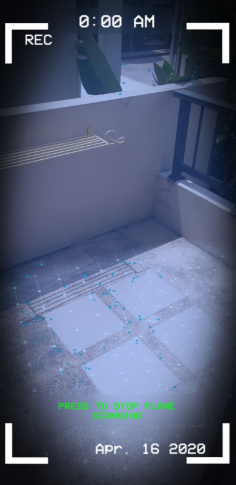
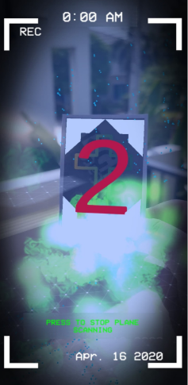
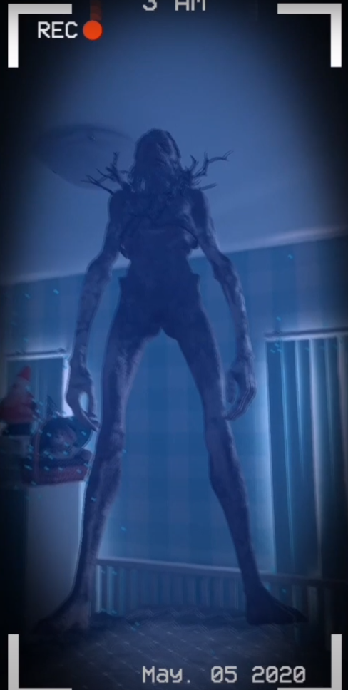
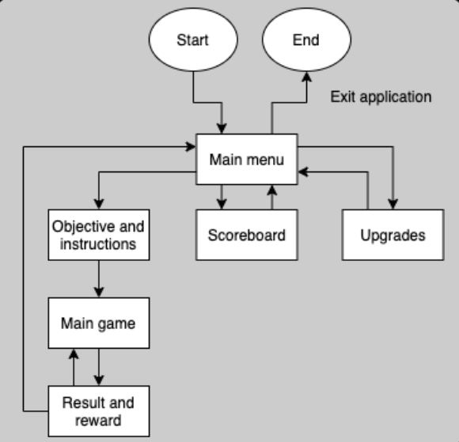
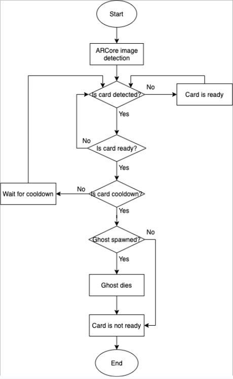
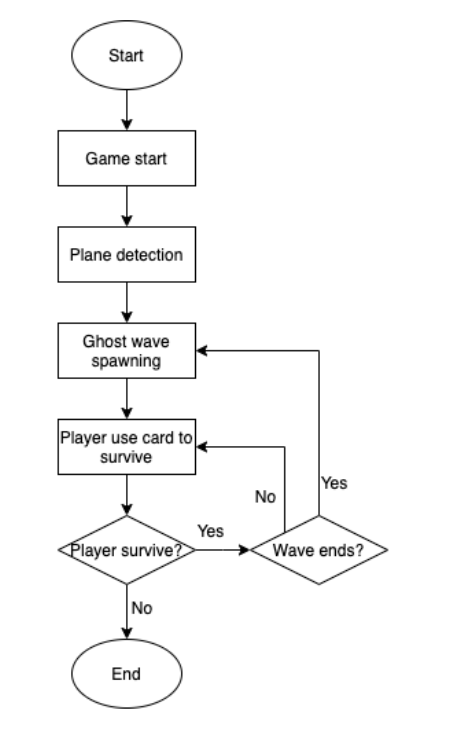

# ARGHOST
### A mobile augmented-reality survival horror game which simulates real ghost experiences and beating the other players’ scores from all around the world

###### If You want to see the code you can check the Asset/scripts folder.

###### NOTE: If You want to edit our game you can open it in the Unity Engine. Please use 2019 version or above else some errors might happen because Unity doesn't have a fully backward compatibility.

### Trailer
[Link](https://www.youtube.com/watch?v=4bP1rvzgHeA&feature=emb_title)

### Screenshots

### Application Flowchart

### Core Attack Mechanic

### Core Gameflow

### Installation
- Download and install the .apk file
- Print out the card provided

|Android|
|:----------------:|
|[here](https://github.com/masty123/ARGHOST/releases/tag/Version-1)

### Developers roles and responsibilities

|Name|Role|
|:----------------:|:----------------:|
|Theeruth Borisuth| Game & UI designing, Enemy AI, sound managing, camera effect, and bug fixing|
|Pappim   Pipatkasrira |Card detection & ability, Enemy abilities, Score system, Map menu system|
|Nitith   Chayakul|Spawn system, effects|
